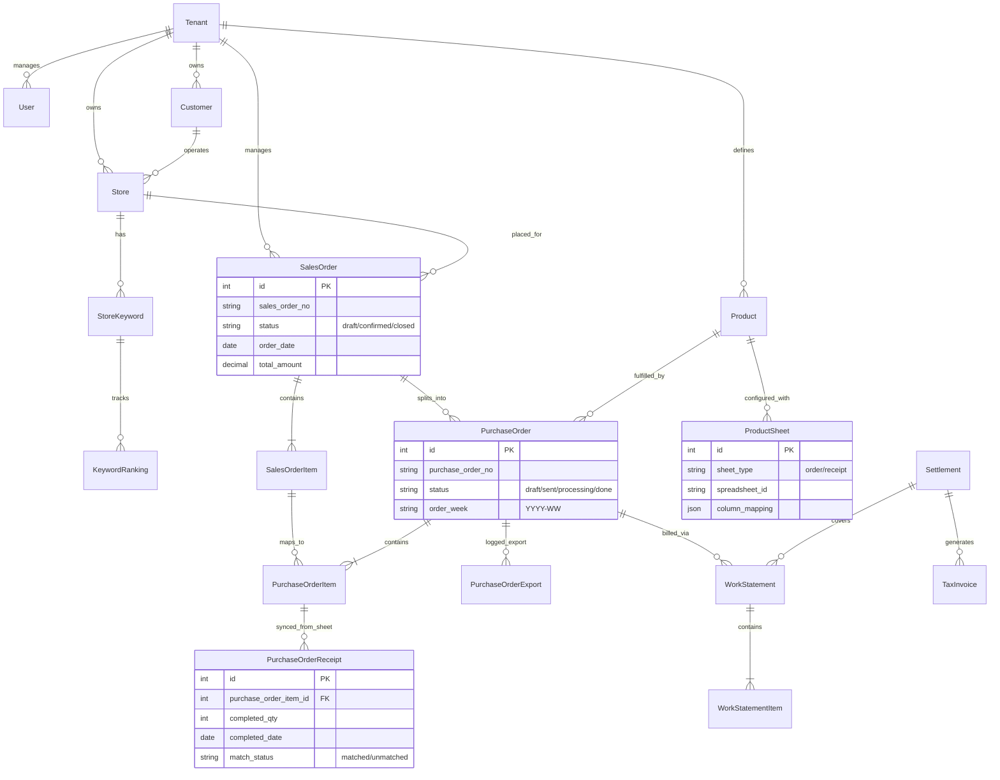

# 42ment ERP v3.0 - Workflow & ERD Analysis

Based on the PRD v3.0 documents, here is the visualization of the System Workflow and Data Model (ERD).

## 1. System Execution Workflow (Business Logic)

This flowchart illustrates the end-to-end process from Customer Contract to Settlement.

```mermaid
flowchart TD
    %% Nodes
    subgraph "1. Contract & Order (계약 및 주문)"
        A[Customer (고객)] -->|Contract| B(Quotation / 견적서)
        B -->|Confirm| C(Sales Order / 통합 주문)
        C -->|Split by Product| D{Purchase Order Generation}
    end

    subgraph "2. Purchase Order & External Sync (발주 및 연동)"
        D -->|Product A| E[Purchase Order A]
        D -->|Product B| F[Purchase Order B]
        
        E -->|Push (Export)| G[Google Sheet - Order A]
        F -->|Push (Export)| H[Google Sheet - Order B]
        
        G -.->|External| I(Marketing Work / Action)
        H -.->|External| I
    end

    subgraph "3. Execution & Validation (실행 및 확인)"
        I -->|Result Input| J[Google Sheet - Receipt A]
        I -->|Result Input| K[Google Sheet - Receipt B]
        
        J -->|Pull (Sync)| L[System Receipt Log A]
        K -->|Pull (Sync)| M[System Receipt Log B]
        
        L -->|Match| N{Matching Validation}
        M -->|Match| N
    end

    subgraph "4. Settlement (정산)"
        N -->|Confirmed| O[Work Statement / 명세서]
        O -->|Billing| P[Settlement / 정산]
        P -->|Invoice| Q[Tax Invoice / 세금계산서]
    end

    %% Styles
    style C fill:#e1f5fe,stroke:#01579b
    style G fill:#e8f5e9,stroke:#2e7d32
    style H fill:#e8f5e9,stroke:#2e7d32
    style J fill:#f3e5f5,stroke:#7b1fa2
    style K fill:#f3e5f5,stroke:#7b1fa2
    style Q fill:#fff3e0,stroke:#e65100
```

### Key Flows:
1.  **Sales Order (SO)**: The customer-facing order. One SO can contain multiple products (e.g., "Keyword Search" + "Review").
2.  **Purchase Order (PO)**: The supplier/product-facing order. The system automatically splits the SO into multiple POs based on the product type.
3.  **Google Sheet Sync**:
    -   **Push**: POs are written to specific Google Sheets for each product team.
    -   **Pull**: Work results are read from "Receipt Sheets" and synced back to the ERP.

---

## 2. Entity Relationship Diagram (ERD)

This diagram represents the core database structure derived from the PRD.



### Key Relationships:
-   **SalesOrder vs PurchaseOrder**: 1 SalesOrder splits into N PurchaseOrders (1 per product type).
-   **ProductSheet**: Configures how a Product maps to a Google Sheet (URL, columns).
-   **PurchaseOrderReceipt**: Stores the raw work results synced back from Google Sheets before they are officially finalized into a Work Statement.

---

## 3. Implementation Roadmap Strategy

Based on the dependencies, here is the suggested execution strategy:

1.  **Core Data Setup (Phase 0)**:
    -   `Tenants`, `Users`, `Customers`, `Stores`, `Products` tables must be built first.
2.  **Order Logic (Phase 1)**:
    -   Implement `SalesOrder` -> `PurchaseOrder` splitting logic.
    -   This is the "Brain" of the ERP.
3.  **Sheet Integration (Phase 1.5)**:
    -   Build the Google Sheets Connector (Adapter Pattern).
    -   Implement the `ProductSheet` configuration to allow dynamic mapping without code changes.
4.  **Sync & Validation (Phase 2)**:
    -   Implement the logic to match `PurchaseOrderReceipt` (Sheet rows) with `PurchaseOrderItem` (DB rows).
    -   Handle "Unmatched" cases (e.g., typo in Sheet).
