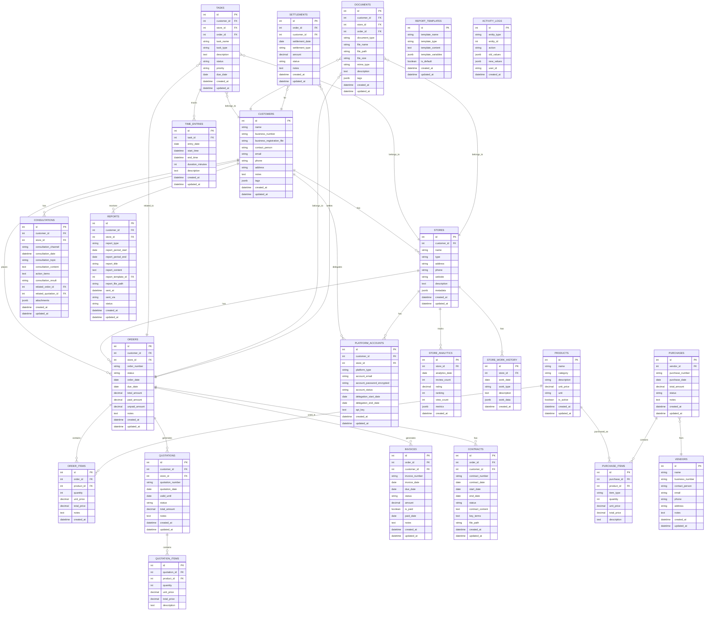

# 데이터베이스 ERD 및 스키마 설계

## 1. ERD 다이어그램

## 2. 테이블별 상세 스키마

### 2.1 CUSTOMERS (고객)

| 컬럼명 | 타입 | 제약조건 | 설명 |
|--------|------|----------|------|
| id | SERIAL | PRIMARY KEY | 고객 ID |
| name | VARCHAR(255) | NOT NULL | 고객명/회사명 |
| business_number | VARCHAR(50) | UNIQUE | 사업자번호 |
| business_registration_file | VARCHAR(500) | | 사업자등록증 파일 경로 |
| contact_person | VARCHAR(100) | | 담당자명 |
| email | VARCHAR(255) | | 이메일 |
| phone | VARCHAR(50) | | 전화번호 |
| address | TEXT | | 주소 |
| notes | TEXT | | 메모 |
| tags | JSONB | | 태그 (배열) |
| created_at | TIMESTAMP | NOT NULL DEFAULT NOW() | 생성일시 |
| updated_at | TIMESTAMP | NOT NULL DEFAULT NOW() | 수정일시 |

**인덱스**:
- `idx_customers_business_number` ON customers(business_number)
- `idx_customers_name` ON customers(name)
- `idx_customers_tags` ON customers USING GIN(tags)

### 2.2 STORES (매장)

| 컬럼명 | 타입 | 제약조건 | 설명 |
|--------|------|----------|------|
| id | SERIAL | PRIMARY KEY | 매장 ID |
| customer_id | INTEGER | FOREIGN KEY → customers(id) | 고객 ID |
| name | VARCHAR(255) | NOT NULL | 매장명 |
| type | VARCHAR(50) | | 매장 유형 |
| address | TEXT | | 주소 |
| phone | VARCHAR(50) | | 전화번호 |
| website | VARCHAR(500) | | 웹사이트 |
| description | TEXT | | 설명 |
| metadata | JSONB | | 추가 메타데이터 |
| created_at | TIMESTAMP | NOT NULL DEFAULT NOW() | 생성일시 |
| updated_at | TIMESTAMP | NOT NULL DEFAULT NOW() | 수정일시 |

**인덱스**:
- `idx_stores_customer_id` ON stores(customer_id)
- `idx_stores_name` ON stores(name)

### 2.3 PLATFORM_ACCOUNTS (플랫폼 계정)

| 컬럼명 | 타입 | 제약조건 | 설명 |
|--------|------|----------|------|
| id | SERIAL | PRIMARY KEY | 계정 ID |
| customer_id | INTEGER | FOREIGN KEY → customers(id) | 고객 ID |
| store_id | INTEGER | FOREIGN KEY → stores(id) | 매장 ID |
| platform_type | VARCHAR(50) | NOT NULL | 플랫폼 타입 (naver_place, google_business, kakao_map 등) |
| account_email | VARCHAR(255) | | 계정 이메일 |
| account_password_encrypted | TEXT | | 암호화된 비밀번호 |
| account_status | VARCHAR(20) | DEFAULT 'active' | 계정 상태 (active, inactive, suspended) |
| delegation_start_date | DATE | | 위탁 시작일 |
| delegation_end_date | DATE | | 위탁 종료일 |
| api_key | TEXT | | API 키 (있는 경우) |
| created_at | TIMESTAMP | NOT NULL DEFAULT NOW() | 생성일시 |
| updated_at | TIMESTAMP | NOT NULL DEFAULT NOW() | 수정일시 |

**인덱스**:
- `idx_platform_accounts_customer_id` ON platform_accounts(customer_id)
- `idx_platform_accounts_store_id` ON platform_accounts(store_id)
- `idx_platform_accounts_platform_type` ON platform_accounts(platform_type)
- `idx_platform_accounts_delegation_end_date` ON platform_accounts(delegation_end_date)

### 2.4 ORDERS (주문)

| 컬럼명 | 타입 | 제약조건 | 설명 |
|--------|------|----------|------|
| id | SERIAL | PRIMARY KEY | 주문 ID |
| customer_id | INTEGER | FOREIGN KEY → customers(id) | 고객 ID |
| store_id | INTEGER | FOREIGN KEY → stores(id) | 매장 ID |
| order_number | VARCHAR(100) | UNIQUE NOT NULL | 주문번호 |
| status | VARCHAR(50) | DEFAULT 'pending' | 주문 상태 (pending, in_progress, completed, cancelled) |
| order_date | DATE | NOT NULL | 주문일 |
| due_date | DATE | | 납기일 |
| total_amount | DECIMAL(15,2) | NOT NULL DEFAULT 0 | 총 금액 |
| paid_amount | DECIMAL(15,2) | DEFAULT 0 | 지불 금액 |
| unpaid_amount | DECIMAL(15,2) | DEFAULT 0 | 미지불 금액 |
| notes | TEXT | | 메모 |
| created_at | TIMESTAMP | NOT NULL DEFAULT NOW() | 생성일시 |
| updated_at | TIMESTAMP | NOT NULL DEFAULT NOW() | 수정일시 |

**인덱스**:
- `idx_orders_customer_id` ON orders(customer_id)
- `idx_orders_store_id` ON orders(store_id)
- `idx_orders_order_number` ON orders(order_number)
- `idx_orders_order_date` ON orders(order_date)
- `idx_orders_status` ON orders(status)

### 2.5 PRODUCTS (상품)

| 컬럼명 | 타입 | 제약조건 | 설명 |
|--------|------|----------|------|
| id | SERIAL | PRIMARY KEY | 상품 ID |
| name | VARCHAR(255) | NOT NULL | 상품명 |
| category | VARCHAR(100) | | 카테고리 |
| description | TEXT | | 설명 |
| unit_price | DECIMAL(15,2) | NOT NULL | 단가 |
| unit | VARCHAR(50) | | 단위 |
| is_active | BOOLEAN | DEFAULT true | 활성 여부 |
| created_at | TIMESTAMP | NOT NULL DEFAULT NOW() | 생성일시 |
| updated_at | TIMESTAMP | NOT NULL DEFAULT NOW() | 수정일시 |

**인덱스**:
- `idx_products_name` ON products(name)
- `idx_products_category` ON products(category)
- `idx_products_is_active` ON products(is_active)

### 2.6 ORDER_ITEMS (주문 항목)

| 컬럼명 | 타입 | 제약조건 | 설명 |
|--------|------|----------|------|
| id | SERIAL | PRIMARY KEY | 주문 항목 ID |
| order_id | INTEGER | FOREIGN KEY → orders(id) | 주문 ID |
| product_id | INTEGER | FOREIGN KEY → products(id) | 상품 ID |
| quantity | INTEGER | NOT NULL DEFAULT 1 | 수량 |
| unit_price | DECIMAL(15,2) | NOT NULL | 단가 |
| total_price | DECIMAL(15,2) | NOT NULL | 총 금액 |
| notes | TEXT | | 메모 |
| created_at | TIMESTAMP | NOT NULL DEFAULT NOW() | 생성일시 |

**인덱스**:
- `idx_order_items_order_id` ON order_items(order_id)
- `idx_order_items_product_id` ON order_items(product_id)

### 2.7 QUOTATIONS (견적서)

| 컬럼명 | 타입 | 제약조건 | 설명 |
|--------|------|----------|------|
| id | SERIAL | PRIMARY KEY | 견적서 ID |
| customer_id | INTEGER | FOREIGN KEY → customers(id) | 고객 ID |
| store_id | INTEGER | FOREIGN KEY → stores(id) | 매장 ID |
| quotation_number | VARCHAR(100) | UNIQUE NOT NULL | 견적서 번호 |
| quotation_date | DATE | NOT NULL | 견적서 작성일 |
| valid_until | DATE | | 유효기간 |
| status | VARCHAR(50) | DEFAULT 'draft' | 상태 (draft, sent, accepted, rejected, expired) |
| total_amount | DECIMAL(15,2) | NOT NULL DEFAULT 0 | 총 금액 |
| notes | TEXT | | 메모 |
| created_at | TIMESTAMP | NOT NULL DEFAULT NOW() | 생성일시 |
| updated_at | TIMESTAMP | NOT NULL DEFAULT NOW() | 수정일시 |

**인덱스**:
- `idx_quotations_customer_id` ON quotations(customer_id)
- `idx_quotations_quotation_number` ON quotations(quotation_number)
- `idx_quotations_status` ON quotations(status)

### 2.8 QUOTATION_ITEMS (견적서 항목)

| 컬럼명 | 타입 | 제약조건 | 설명 |
|--------|------|----------|------|
| id | SERIAL | PRIMARY KEY | 견적서 항목 ID |
| quotation_id | INTEGER | FOREIGN KEY → quotations(id) | 견적서 ID |
| product_id | INTEGER | FOREIGN KEY → products(id) | 상품 ID |
| quantity | INTEGER | NOT NULL DEFAULT 1 | 수량 |
| unit_price | DECIMAL(15,2) | NOT NULL | 단가 |
| total_price | DECIMAL(15,2) | NOT NULL | 총 금액 |
| description | TEXT | | 설명 |

**인덱스**:
- `idx_quotation_items_quotation_id` ON quotation_items(quotation_id)

### 2.9 INVOICES (세금계산서)

| 컬럼명 | 타입 | 제약조건 | 설명 |
|--------|------|----------|------|
| id | SERIAL | PRIMARY KEY | 세금계산서 ID |
| order_id | INTEGER | FOREIGN KEY → orders(id) | 주문 ID |
| customer_id | INTEGER | FOREIGN KEY → customers(id) | 고객 ID |
| invoice_number | VARCHAR(100) | UNIQUE NOT NULL | 세금계산서 번호 |
| invoice_date | DATE | NOT NULL | 발행일 |
| due_date | DATE | | 납기일 |
| status | VARCHAR(50) | DEFAULT 'pending' | 상태 (pending, sent, paid, overdue) |
| amount | DECIMAL(15,2) | NOT NULL | 금액 |
| is_paid | BOOLEAN | DEFAULT false | 지불 여부 |
| paid_date | DATE | | 지불일 |
| notes | TEXT | | 메모 |
| created_at | TIMESTAMP | NOT NULL DEFAULT NOW() | 생성일시 |
| updated_at | TIMESTAMP | NOT NULL DEFAULT NOW() | 수정일시 |

**인덱스**:
- `idx_invoices_order_id` ON invoices(order_id)
- `idx_invoices_customer_id` ON invoices(customer_id)
- `idx_invoices_invoice_number` ON invoices(invoice_number)
- `idx_invoices_status` ON invoices(status)
- `idx_invoices_is_paid` ON invoices(is_paid)

### 2.10 CONTRACTS (계약서)

| 컬럼명 | 타입 | 제약조건 | 설명 |
|--------|------|----------|------|
| id | SERIAL | PRIMARY KEY | 계약서 ID |
| order_id | INTEGER | FOREIGN KEY → orders(id) | 주문 ID |
| customer_id | INTEGER | FOREIGN KEY → customers(id) | 고객 ID |
| contract_number | VARCHAR(100) | UNIQUE NOT NULL | 계약서 번호 |
| contract_date | DATE | NOT NULL | 계약일 |
| start_date | DATE | | 시작일 |
| end_date | DATE | | 종료일 |
| status | VARCHAR(50) | DEFAULT 'active' | 상태 (active, expired, terminated) |
| contract_content | TEXT | | 계약 내용 |
| key_terms | TEXT | | 핵심 조건 (JSON 또는 텍스트) |
| file_path | VARCHAR(500) | | 계약서 파일 경로 |
| created_at | TIMESTAMP | NOT NULL DEFAULT NOW() | 생성일시 |
| updated_at | TIMESTAMP | NOT NULL DEFAULT NOW() | 수정일시 |

**인덱스**:
- `idx_contracts_order_id` ON contracts(order_id)
- `idx_contracts_customer_id` ON contracts(customer_id)
- `idx_contracts_end_date` ON contracts(end_date)
- `idx_contracts_status` ON contracts(status)

### 2.11 PURCHASES (구매)

| 컬럼명 | 타입 | 제약조건 | 설명 |
|--------|------|----------|------|
| id | SERIAL | PRIMARY KEY | 구매 ID |
| vendor_id | INTEGER | FOREIGN KEY → vendors(id) | 거래처 ID |
| purchase_number | VARCHAR(100) | UNIQUE NOT NULL | 구매번호 |
| purchase_date | DATE | NOT NULL | 구매일 |
| total_amount | DECIMAL(15,2) | NOT NULL DEFAULT 0 | 총 금액 |
| status | VARCHAR(50) | DEFAULT 'pending' | 상태 (pending, completed, cancelled) |
| notes | TEXT | | 메모 |
| created_at | TIMESTAMP | NOT NULL DEFAULT NOW() | 생성일시 |
| updated_at | TIMESTAMP | NOT NULL DEFAULT NOW() | 수정일시 |

**인덱스**:
- `idx_purchases_vendor_id` ON purchases(vendor_id)
- `idx_purchases_purchase_date` ON purchases(purchase_date)

### 2.12 PURCHASE_ITEMS (구매 항목)

| 컬럼명 | 타입 | 제약조건 | 설명 |
|--------|------|----------|------|
| id | SERIAL | PRIMARY KEY | 구매 항목 ID |
| purchase_id | INTEGER | FOREIGN KEY → purchases(id) | 구매 ID |
| product_id | INTEGER | FOREIGN KEY → products(id) | 상품 ID |
| item_type | VARCHAR(50) | | 항목 유형 (product, traffic, blog, receipt 등) |
| quantity | INTEGER | NOT NULL DEFAULT 1 | 수량 |
| unit_price | DECIMAL(15,2) | NOT NULL | 단가 |
| total_price | DECIMAL(15,2) | NOT NULL | 총 금액 |
| description | TEXT | | 설명 |

**인덱스**:
- `idx_purchase_items_purchase_id` ON purchase_items(purchase_id)

### 2.13 VENDORS (거래처)

| 컬럼명 | 타입 | 제약조건 | 설명 |
|--------|------|----------|------|
| id | SERIAL | PRIMARY KEY | 거래처 ID |
| name | VARCHAR(255) | NOT NULL | 거래처명 |
| business_number | VARCHAR(50) | | 사업자번호 |
| contact_person | VARCHAR(100) | | 담당자명 |
| email | VARCHAR(255) | | 이메일 |
| phone | VARCHAR(50) | | 전화번호 |
| address | TEXT | | 주소 |
| notes | TEXT | | 메모 |
| created_at | TIMESTAMP | NOT NULL DEFAULT NOW() | 생성일시 |
| updated_at | TIMESTAMP | NOT NULL DEFAULT NOW() | 수정일시 |

**인덱스**:
- `idx_vendors_name` ON vendors(name)
- `idx_vendors_business_number` ON vendors(business_number)

### 2.14 STORE_ANALYTICS (매장 분석 정보)

| 컬럼명 | 타입 | 제약조건 | 설명 |
|--------|------|----------|------|
| id | SERIAL | PRIMARY KEY | 분석 정보 ID |
| store_id | INTEGER | FOREIGN KEY → stores(id) | 매장 ID |
| analytics_date | DATE | NOT NULL | 분석일 |
| review_count | INTEGER | DEFAULT 0 | 리뷰 수 |
| rating | DECIMAL(3,2) | | 평점 |
| ranking | INTEGER | | 순위 |
| view_count | INTEGER | DEFAULT 0 | 조회수 |
| metrics | JSONB | | 추가 지표 |
| created_at | TIMESTAMP | NOT NULL DEFAULT NOW() | 생성일시 |

**인덱스**:
- `idx_store_analytics_store_id` ON store_analytics(store_id)
- `idx_store_analytics_analytics_date` ON store_analytics(analytics_date)

### 2.15 STORE_WORK_HISTORY (매장 작업 히스토리)

| 컬럼명 | 타입 | 제약조건 | 설명 |
|--------|------|----------|------|
| id | SERIAL | PRIMARY KEY | 작업 히스토리 ID |
| store_id | INTEGER | FOREIGN KEY → stores(id) | 매장 ID |
| work_date | DATE | NOT NULL | 작업일 |
| work_type | VARCHAR(100) | | 작업 유형 |
| description | TEXT | | 설명 |
| work_data | JSONB | | 작업 데이터 |
| created_at | TIMESTAMP | NOT NULL DEFAULT NOW() | 생성일시 |

**인덱스**:
- `idx_store_work_history_store_id` ON store_work_history(store_id)
- `idx_store_work_history_work_date` ON store_work_history(work_date)

### 2.16 CONSULTATIONS (상담 히스토리)

| 컬럼명 | 타입 | 제약조건 | 설명 |
|--------|------|----------|------|
| id | SERIAL | PRIMARY KEY | 상담 ID |
| customer_id | INTEGER | FOREIGN KEY → customers(id) | 고객 ID |
| store_id | INTEGER | FOREIGN KEY → stores(id) | 매장 ID |
| consultation_channel | VARCHAR(50) | NOT NULL | 상담 채널 (kakao, phone, email, face_to_face 등) |
| consultation_date | TIMESTAMP | NOT NULL | 상담일시 |
| consultation_topic | VARCHAR(255) | | 상담 주제 |
| consultation_content | TEXT | | 상담 내용 |
| action_items | TEXT | | 액션 아이템 |
| consultation_result | VARCHAR(50) | | 상담 결과 (success, pending, cancelled) |
| related_order_id | INTEGER | FOREIGN KEY → orders(id) | 관련 주문 ID |
| related_quotation_id | INTEGER | FOREIGN KEY → quotations(id) | 관련 견적서 ID |
| attachments | JSONB | | 첨부 파일 정보 |
| created_at | TIMESTAMP | NOT NULL DEFAULT NOW() | 생성일시 |
| updated_at | TIMESTAMP | NOT NULL DEFAULT NOW() | 수정일시 |

**인덱스**:
- `idx_consultations_customer_id` ON consultations(customer_id)
- `idx_consultations_store_id` ON consultations(store_id)
- `idx_consultations_consultation_date` ON consultations(consultation_date)
- `idx_consultations_consultation_channel` ON consultations(consultation_channel)

### 2.17 REPORTS (보고서)

| 컬럼명 | 타입 | 제약조건 | 설명 |
|--------|------|----------|------|
| id | SERIAL | PRIMARY KEY | 보고서 ID |
| customer_id | INTEGER | FOREIGN KEY → customers(id) | 고객 ID |
| store_id | INTEGER | FOREIGN KEY → stores(id) | 매장 ID |
| report_type | VARCHAR(50) | NOT NULL | 보고서 유형 (regular, performance, settlement, custom) |
| report_period_start | DATE | | 보고 기간 시작일 |
| report_period_end | DATE | | 보고 기간 종료일 |
| report_title | VARCHAR(255) | NOT NULL | 보고서 제목 |
| report_content | TEXT | | 보고서 내용 |
| report_template_id | INTEGER | FOREIGN KEY → report_templates(id) | 템플릿 ID |
| report_file_path | VARCHAR(500) | | 보고서 파일 경로 |
| sent_at | TIMESTAMP | | 발송일시 |
| sent_via | VARCHAR(50) | | 발송 방법 (email, kakao, other) |
| status | VARCHAR(20) | DEFAULT 'draft' | 상태 (draft, sent, viewed) |
| created_at | TIMESTAMP | NOT NULL DEFAULT NOW() | 생성일시 |
| updated_at | TIMESTAMP | NOT NULL DEFAULT NOW() | 수정일시 |

**인덱스**:
- `idx_reports_customer_id` ON reports(customer_id)
- `idx_reports_store_id` ON reports(store_id)
- `idx_reports_report_type` ON reports(report_type)
- `idx_reports_sent_at` ON reports(sent_at)

### 2.18 REPORT_TEMPLATES (보고서 템플릿)

| 컬럼명 | 타입 | 제약조건 | 설명 |
|--------|------|----------|------|
| id | SERIAL | PRIMARY KEY | 템플릿 ID |
| template_name | VARCHAR(255) | NOT NULL | 템플릿명 |
| template_type | VARCHAR(50) | | 템플릿 유형 |
| template_content | TEXT | | 템플릿 내용 (HTML 또는 마크다운) |
| template_variables | JSONB | | 사용 가능한 변수 목록 |
| is_default | BOOLEAN | DEFAULT false | 기본 템플릿 여부 |
| created_at | TIMESTAMP | NOT NULL DEFAULT NOW() | 생성일시 |
| updated_at | TIMESTAMP | NOT NULL DEFAULT NOW() | 수정일시 |

**인덱스**:
- `idx_report_templates_template_type` ON report_templates(template_type)

### 2.19 TASKS (작업)

| 컬럼명 | 타입 | 제약조건 | 설명 |
|--------|------|----------|------|
| id | SERIAL | PRIMARY KEY | 작업 ID |
| customer_id | INTEGER | FOREIGN KEY → customers(id) | 고객 ID |
| store_id | INTEGER | FOREIGN KEY → stores(id) | 매장 ID |
| order_id | INTEGER | FOREIGN KEY → orders(id) | 주문 ID |
| task_name | VARCHAR(255) | NOT NULL | 작업명 |
| task_type | VARCHAR(100) | | 작업 유형 |
| description | TEXT | | 설명 |
| status | VARCHAR(50) | DEFAULT 'pending' | 상태 (pending, in_progress, completed, cancelled) |
| priority | VARCHAR(20) | DEFAULT 'medium' | 우선순위 (low, medium, high, urgent) |
| due_date | DATE | | 마감일 |
| created_at | TIMESTAMP | NOT NULL DEFAULT NOW() | 생성일시 |
| updated_at | TIMESTAMP | NOT NULL DEFAULT NOW() | 수정일시 |

**인덱스**:
- `idx_tasks_customer_id` ON tasks(customer_id)
- `idx_tasks_store_id` ON tasks(store_id)
- `idx_tasks_order_id` ON tasks(order_id)
- `idx_tasks_status` ON tasks(status)
- `idx_tasks_priority` ON tasks(priority)
- `idx_tasks_due_date` ON tasks(due_date)

### 2.20 TIME_ENTRIES (시간 기록)

| 컬럼명 | 타입 | 제약조건 | 설명 |
|--------|------|----------|------|
| id | SERIAL | PRIMARY KEY | 시간 기록 ID |
| task_id | INTEGER | FOREIGN KEY → tasks(id) | 작업 ID |
| entry_date | DATE | NOT NULL | 기록일 |
| start_time | TIMESTAMP | NOT NULL | 시작 시간 |
| end_time | TIMESTAMP | | 종료 시간 |
| duration_minutes | INTEGER | | 소요 시간 (분) |
| description | TEXT | | 설명 |
| created_at | TIMESTAMP | NOT NULL DEFAULT NOW() | 생성일시 |
| updated_at | TIMESTAMP | NOT NULL DEFAULT NOW() | 수정일시 |

**인덱스**:
- `idx_time_entries_task_id` ON time_entries(task_id)
- `idx_time_entries_entry_date` ON time_entries(entry_date)

### 2.21 DOCUMENTS (문서)

| 컬럼명 | 타입 | 제약조건 | 설명 |
|--------|------|----------|------|
| id | SERIAL | PRIMARY KEY | 문서 ID |
| customer_id | INTEGER | FOREIGN KEY → customers(id) | 고객 ID |
| store_id | INTEGER | FOREIGN KEY → stores(id) | 매장 ID |
| order_id | INTEGER | FOREIGN KEY → orders(id) | 주문 ID |
| document_type | VARCHAR(100) | NOT NULL | 문서 유형 |
| file_name | VARCHAR(255) | NOT NULL | 파일명 |
| file_path | VARCHAR(500) | NOT NULL | 파일 경로 |
| file_size | VARCHAR(50) | | 파일 크기 |
| mime_type | VARCHAR(100) | | MIME 타입 |
| description | TEXT | | 설명 |
| tags | JSONB | | 태그 |
| created_at | TIMESTAMP | NOT NULL DEFAULT NOW() | 생성일시 |
| updated_at | TIMESTAMP | NOT NULL DEFAULT NOW() | 수정일시 |

**인덱스**:
- `idx_documents_customer_id` ON documents(customer_id)
- `idx_documents_store_id` ON documents(store_id)
- `idx_documents_order_id` ON documents(order_id)
- `idx_documents_document_type` ON documents(document_type)
- `idx_documents_tags` ON documents USING GIN(tags)

### 2.22 SETTLEMENTS (정산)

| 컬럼명 | 타입 | 제약조건 | 설명 |
|--------|------|----------|------|
| id | SERIAL | PRIMARY KEY | 정산 ID |
| order_id | INTEGER | FOREIGN KEY → orders(id) | 주문 ID |
| customer_id | INTEGER | FOREIGN KEY → customers(id) | 고객 ID |
| settlement_date | DATE | NOT NULL | 정산일 |
| settlement_type | VARCHAR(50) | | 정산 유형 |
| amount | DECIMAL(15,2) | NOT NULL | 금액 |
| status | VARCHAR(50) | DEFAULT 'pending' | 상태 |
| notes | TEXT | | 메모 |
| created_at | TIMESTAMP | NOT NULL DEFAULT NOW() | 생성일시 |
| updated_at | TIMESTAMP | NOT NULL DEFAULT NOW() | 수정일시 |

**인덱스**:
- `idx_settlements_order_id` ON settlements(order_id)
- `idx_settlements_customer_id` ON settlements(customer_id)
- `idx_settlements_settlement_date` ON settlements(settlement_date)

### 2.23 ACTIVITY_LOGS (활동 로그)

| 컬럼명 | 타입 | 제약조건 | 설명 |
|--------|------|----------|------|
| id | SERIAL | PRIMARY KEY | 로그 ID |
| entity_type | VARCHAR(100) | NOT NULL | 엔티티 타입 |
| entity_id | INTEGER | NOT NULL | 엔티티 ID |
| action | VARCHAR(50) | NOT NULL | 액션 (create, update, delete) |
| old_values | JSONB | | 변경 전 값 |
| new_values | JSONB | | 변경 후 값 |
| user_id | VARCHAR(100) | | 사용자 ID |
| created_at | TIMESTAMP | NOT NULL DEFAULT NOW() | 생성일시 |

**인덱스**:
- `idx_activity_logs_entity` ON activity_logs(entity_type, entity_id)
- `idx_activity_logs_created_at` ON activity_logs(created_at)

## 3. 관계 정의

### 3.1 주요 관계

1. **CUSTOMERS ↔ STORES**: 1:N (한 고객은 여러 매장 보유)
2. **CUSTOMERS ↔ ORDERS**: 1:N (한 고객은 여러 주문)
3. **STORES ↔ ORDERS**: 1:N (한 매장은 여러 주문)
4. **ORDERS ↔ ORDER_ITEMS**: 1:N (한 주문은 여러 주문 항목)
5. **PRODUCTS ↔ ORDER_ITEMS**: 1:N (한 상품은 여러 주문 항목에 사용)
6. **ORDERS ↔ QUOTATIONS**: 1:1 (주문은 견적서에서 생성 가능)
7. **ORDERS ↔ INVOICES**: 1:N (한 주문은 여러 세금계산서)
8. **ORDERS ↔ CONTRACTS**: 1:1 (주문은 계약서와 연결)
9. **CUSTOMERS ↔ CONSULTATIONS**: 1:N (한 고객은 여러 상담)
10. **CUSTOMERS ↔ REPORTS**: 1:N (한 고객은 여러 보고서)
11. **TASKS ↔ TIME_ENTRIES**: 1:N (한 작업은 여러 시간 기록)

### 3.2 외래 키 제약조건

- 모든 외래 키는 `ON DELETE RESTRICT` (참조 무결성 유지)
- `updated_at` 컬럼은 트리거로 자동 업데이트

## 4. 인덱스 전략

### 4.1 기본 인덱스
- 모든 PRIMARY KEY는 자동 인덱스
- 모든 FOREIGN KEY에 인덱스 생성

### 4.2 검색 최적화 인덱스
- 자주 검색되는 컬럼 (name, email, phone 등)
- 날짜 범위 조회가 많은 컬럼 (order_date, created_at 등)
- 상태 필터링이 많은 컬럼 (status)

### 4.3 JSONB 인덱스
- GIN 인덱스 사용 (tags, metadata 등)

## 5. 마이그레이션 계획

### 5.1 초기 마이그레이션
1. 기본 테이블 생성 (customers, stores, products)
2. 주문 관련 테이블 (orders, order_items)
3. 정산 관련 테이블 (invoices, settlements)
4. 작업 관리 테이블 (tasks, time_entries)
5. 문서 및 로그 테이블

### 5.2 확장 마이그레이션 (Phase 2)
1. 플랫폼 계정 테이블
2. 보고서 템플릿 테이블
3. 추가 분석 테이블

### 5.3 데이터 마이그레이션
- 초기 데이터는 수동 입력 또는 CSV 임포트
- 기존 데이터가 있는 경우 마이그레이션 스크립트 작성

## 6. 데이터 무결성 규칙

### 6.1 체크 제약조건
- `total_amount >= 0`
- `paid_amount >= 0`
- `unpaid_amount >= 0`
- `quantity > 0`
- `rating BETWEEN 0 AND 5`

### 6.2 트리거
- `updated_at` 자동 업데이트
- `total_amount` 자동 계산 (order_items 합계)
- `unpaid_amount` 자동 계산 (total_amount - paid_amount)

## 7. 성능 최적화

### 7.1 파티셔닝 (향후)
- `activity_logs` 테이블은 날짜별 파티셔닝 고려
- `store_analytics` 테이블은 월별 파티셔닝 고려

### 7.2 캐싱 전략
- 자주 조회되는 데이터 (고객 목록, 상품 목록)는 Redis 캐싱 고려
- 대시보드 집계 데이터는 주기적으로 미리 계산

