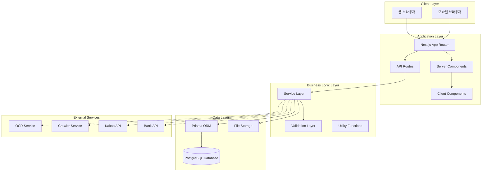
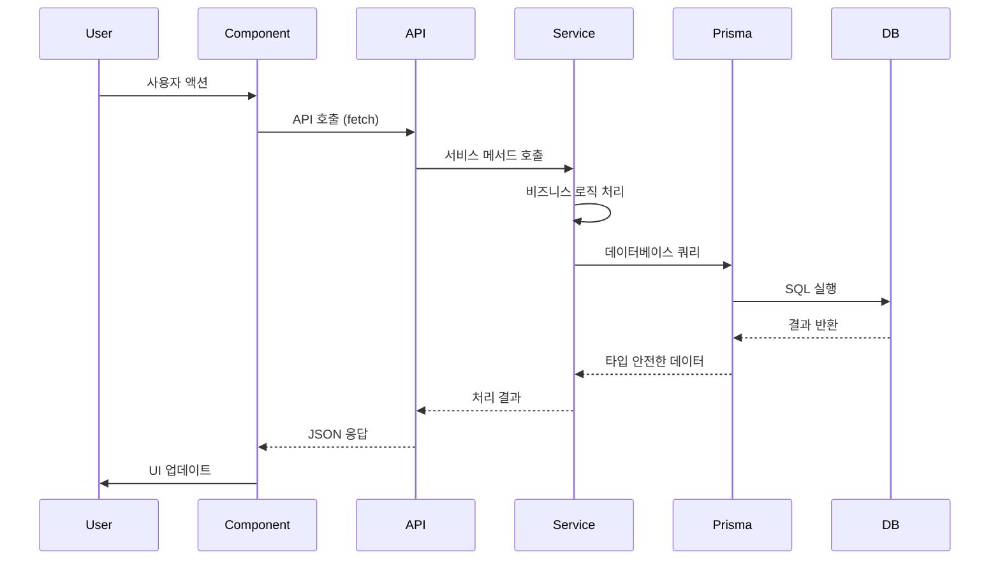

# 시스템 아키텍처 설계

## 1. 전체 시스템 구조도



## 2. 기술 스택 상세 설명

### 2.1 프론트엔드/백엔드
- **Next.js 14+ (App Router)**
  - 풀스택 프레임워크로 프론트엔드와 백엔드를 통합 개발
  - Server Components로 서버 사이드 렌더링 최적화
  - API Routes로 RESTful API 제공
  - 파일 기반 라우팅으로 직관적인 구조

### 2.2 언어
- **TypeScript**
  - 타입 안정성으로 런타임 에러 방지
  - 코드 자동완성 및 리팩토링 지원
  - 인터페이스로 데이터 구조 명확화

### 2.3 데이터베이스
- **PostgreSQL**
  - 관계형 데이터베이스로 복잡한 관계 관리
  - JSONB 타입으로 유연한 데이터 저장
  - 트랜잭션 지원으로 데이터 무결성 보장
  - 확장성 및 성능

### 2.4 ORM
- **Prisma**
  - 타입 안전한 데이터베이스 접근
  - 마이그레이션 관리
  - 자동 생성되는 TypeScript 타입
  - 쿼리 최적화

### 2.5 스타일링
- **Tailwind CSS**
  - 유틸리티 퍼스트 CSS 프레임워크
  - 빠른 UI 개발
  - 반응형 디자인 지원

- **shadcn/ui**
  - 재사용 가능한 컴포넌트 라이브러리
  - 접근성 고려된 컴포넌트
  - 커스터마이징 용이

### 2.6 인증 (향후 확장)
- **NextAuth.js**
  - 다양한 인증 제공자 지원
  - 세션 관리
  - 권한 관리

### 2.7 파일 저장
- **MVP**: 로컬 파일 시스템
- **Phase 2**: AWS S3 또는 클라우드 스토리지

### 2.8 추가 라이브러리
- **Excel 다운로드**: `xlsx` 또는 `exceljs`
- **PDF 생성**: `pdfkit` 또는 `puppeteer`
- **차트**: `recharts` 또는 `chart.js`
- **폼 관리**: `react-hook-form` + `zod`
- **날짜 처리**: `date-fns`
- **알림**: `react-hot-toast` 또는 `sonner`

## 3. 폴더 구조 설계

```
marketing-agency-system/
├── app/                          # Next.js App Router
│   ├── (auth)/                   # 인증 관련 (향후)
│   │   ├── login/
│   │   └── register/
│   ├── (dashboard)/              # 대시보드 레이아웃
│   │   ├── layout.tsx
│   │   ├── page.tsx              # 대시보드 메인
│   │   ├── customers/            # 고객 관리
│   │   │   ├── page.tsx          # 고객 목록
│   │   │   ├── [id]/             # 고객 상세
│   │   │   │   ├── page.tsx
│   │   │   │   └── edit/
│   │   │   └── new/
│   │   ├── stores/               # 매장 관리
│   │   ├── orders/               # 주문 관리
│   │   ├── sales/                # 판매 관리
│   │   ├── purchases/            # 구매 관리
│   │   ├── settlements/          # 정산 관리
│   │   ├── consultations/        # 상담 관리
│   │   ├── reports/              # 보고서 관리
│   │   ├── tasks/                # 작업 관리
│   │   ├── documents/            # 문서 관리
│   │   └── settings/             # 설정
│   ├── api/                      # API Routes
│   │   ├── customers/
│   │   │   ├── route.ts          # GET, POST
│   │   │   └── [id]/
│   │   │       └── route.ts      # GET, PUT, DELETE
│   │   ├── stores/
│   │   ├── orders/
│   │   ├── quotations/
│   │   ├── invoices/
│   │   ├── settlements/
│   │   ├── consultations/
│   │   ├── reports/
│   │   ├── tasks/
│   │   ├── time-entries/
│   │   ├── documents/
│   │   └── analytics/             # 통계 API
│   ├── layout.tsx                # 루트 레이아웃
│   └── page.tsx                  # 루트 페이지
├── components/                   # React 컴포넌트
│   ├── ui/                       # shadcn/ui 컴포넌트
│   │   ├── button.tsx
│   │   ├── input.tsx
│   │   ├── table.tsx
│   │   ├── dialog.tsx
│   │   ├── form.tsx
│   │   └── ...
│   ├── layout/                   # 레이아웃 컴포넌트
│   │   ├── Sidebar.tsx
│   │   ├── Header.tsx
│   │   └── Footer.tsx
│   ├── customers/                # 고객 관련 컴포넌트
│   │   ├── CustomerList.tsx
│   │   ├── CustomerForm.tsx
│   │   └── CustomerDetail.tsx
│   ├── stores/                   # 매장 관련 컴포넌트
│   ├── orders/                   # 주문 관련 컴포넌트
│   ├── dashboard/                # 대시보드 컴포넌트
│   │   ├── RevenueChart.tsx
│   │   ├── StatsCards.tsx
│   │   └── RecentOrders.tsx
│   └── shared/                   # 공통 컴포넌트
│       ├── DataTable.tsx
│       ├── SearchBar.tsx
│       └── ExportButton.tsx
├── lib/                          # 유틸리티 및 설정
│   ├── prisma/                   # Prisma 클라이언트
│   │   └── client.ts
│   ├── services/                 # 비즈니스 로직
│   │   ├── customer.service.ts
│   │   ├── order.service.ts
│   │   ├── settlement.service.ts
│   │   └── ...
│   ├── validators/               # Zod 스키마
│   │   ├── customer.schema.ts
│   │   ├── order.schema.ts
│   │   └── ...
│   ├── utils/                    # 유틸리티 함수
│   │   ├── format.ts
│   │   ├── date.ts
│   │   ├── export.ts
│   │   └── ...
│   ├── hooks/                    # Custom Hooks
│   │   ├── useCustomers.ts
│   │   ├── useOrders.ts
│   │   └── ...
│   └── constants/                # 상수
│       ├── status.ts
│       └── types.ts
├── prisma/                       # Prisma 설정
│   ├── schema.prisma             # 데이터베이스 스키마
│   ├── migrations/               # 마이그레이션 파일
│   └── seed.ts                   # 시드 데이터
├── public/                       # 정적 파일
│   ├── images/
│   └── files/
├── storage/                      # 파일 저장소 (MVP)
│   ├── documents/
│   ├── invoices/
│   └── reports/
├── types/                        # TypeScript 타입
│   ├── customer.ts
│   ├── order.ts
│   └── ...
├── docs/                         # 문서
├── .env.local                    # 환경 변수
├── .env.example
├── next.config.js
├── tailwind.config.js
├── tsconfig.json
├── package.json
└── README.md
```

## 4. 모듈별 책임 분리

### 4.1 Presentation Layer (UI)

#### 컴포넌트 구조
- **페이지 컴포넌트**: `app/` 디렉토리의 페이지 파일
- **프레젠테이션 컴포넌트**: `components/` 디렉토리
- **UI 컴포넌트**: `components/ui/` (shadcn/ui)

#### 책임
- 사용자 인터페이스 렌더링
- 사용자 입력 처리
- 상태 관리 (로컬 상태)
- API 호출 (서비스 레이어를 통해)

### 4.2 Business Logic Layer

#### 서비스 레이어 (`lib/services/`)
각 도메인별 서비스 파일:
- `customer.service.ts`: 고객 관련 비즈니스 로직
- `order.service.ts`: 주문 관련 비즈니스 로직
- `settlement.service.ts`: 정산 관련 비즈니스 로직
- `report.service.ts`: 보고서 생성 로직
- `export.service.ts`: 데이터 내보내기 로직

#### 책임
- 비즈니스 규칙 구현
- 데이터 검증
- 트랜잭션 관리
- 외부 서비스 연동

### 4.3 Data Access Layer

#### Prisma ORM (`lib/prisma/`)
- `client.ts`: Prisma 클라이언트 인스턴스
- 타입 안전한 데이터베이스 쿼리
- 관계형 데이터 조회 최적화

#### 책임
- 데이터베이스 CRUD 작업
- 쿼리 최적화
- 트랜잭션 관리

### 4.4 Validation Layer

#### Zod 스키마 (`lib/validators/`)
- `customer.schema.ts`: 고객 데이터 검증
- `order.schema.ts`: 주문 데이터 검증
- `quotation.schema.ts`: 견적서 데이터 검증

#### 책임
- 입력 데이터 검증
- 타입 안전성 보장
- 에러 메시지 생성

### 4.5 API Layer

#### API Routes (`app/api/`)
- RESTful API 엔드포인트
- 요청/응답 처리
- 에러 핸들링

#### 책임
- HTTP 요청 처리
- 인증/인가 (향후)
- 응답 포맷팅
- 에러 응답

## 5. 데이터 흐름도

### 5.1 일반적인 데이터 흐름



### 5.2 데이터 생성 흐름

1. **사용자 입력** → 컴포넌트에서 폼 입력
2. **클라이언트 검증** → Zod 스키마로 검증
3. **API 호출** → POST/PUT 요청
4. **서버 검증** → 서비스 레이어에서 재검증
5. **비즈니스 로직** → 서비스에서 처리
6. **데이터 저장** → Prisma로 데이터베이스 저장
7. **응답 반환** → 생성된 데이터 반환
8. **UI 업데이트** → 성공/실패 메시지 표시

### 5.3 데이터 조회 흐름

1. **페이지 로드** → Server Component에서 데이터 조회
2. **서비스 호출** → 서비스 레이어에서 데이터 조회
3. **데이터베이스 쿼리** → Prisma로 최적화된 쿼리
4. **데이터 변환** → 필요한 형태로 변환
5. **렌더링** → Server Component에서 직접 렌더링
6. **클라이언트 인터랙션** → Client Component에서 상호작용

## 6. 상태 관리 전략

### 6.1 서버 상태
- **Server Components**: 서버에서 데이터 페칭 및 렌더링
- **API Routes**: 클라이언트에서 필요한 경우 fetch

### 6.2 클라이언트 상태
- **로컬 상태**: `useState` 훅 사용
- **폼 상태**: `react-hook-form` 사용
- **전역 상태**: 필요시 `zustand` 또는 Context API

### 6.3 캐싱 전략
- **Next.js 캐싱**: `fetch`의 `cache` 옵션 활용
- **재검증**: `revalidate` 옵션으로 주기적 갱신
- **향후**: Redis 캐싱 (Phase 2)

## 7. 에러 처리 전략

### 7.1 클라이언트 에러 처리
- **에러 바운더리**: React Error Boundary 사용
- **폼 검증**: Zod로 클라이언트 검증
- **API 에러**: try-catch로 처리하고 사용자 친화적 메시지 표시

### 7.2 서버 에러 처리
- **API Routes**: 표준화된 에러 응답 형식
- **로깅**: 서버 로그에 에러 기록
- **에러 모니터링**: 향후 Sentry 등 도구 연동

### 7.3 에러 응답 형식
```typescript
{
  success: false,
  error: {
    code: "ERROR_CODE",
    message: "사용자 친화적 메시지",
    details?: any
  }
}
```

## 8. 보안 고려사항

### 8.1 인증/인가 (향후)
- NextAuth.js로 세션 관리
- 역할 기반 접근 제어 (RBAC)
- API 라우트 보호

### 8.2 데이터 보안
- 민감 정보 암호화 저장
- SQL Injection 방지 (Prisma 사용)
- XSS 방지 (React의 기본 보호)
- CSRF 방지 (Next.js 기본 보호)

### 8.3 파일 업로드 보안
- 파일 타입 검증
- 파일 크기 제한
- 바이러스 스캔 (향후)

## 9. 성능 최적화

### 9.1 렌더링 최적화
- **Server Components**: 서버에서 렌더링하여 초기 로딩 최적화
- **코드 스플리팅**: 동적 import로 번들 크기 최적화
- **이미지 최적화**: Next.js Image 컴포넌트 사용

### 9.2 데이터베이스 최적화
- 인덱스 최적화
- 쿼리 최적화 (Prisma 쿼리 분석)
- 연결 풀링

### 9.3 캐싱
- 정적 페이지 캐싱
- API 응답 캐싱
- 데이터베이스 쿼리 결과 캐싱 (향후)

## 10. 확장성 고려사항

### 10.1 모듈화
- 도메인별로 모듈 분리
- 서비스 레이어로 비즈니스 로직 분리
- 컴포넌트 재사용성

### 10.2 API 설계
- RESTful API 원칙 준수
- 버전 관리 가능한 구조
- 외부 시스템 연동 가능한 구조

### 10.3 데이터베이스 확장
- 스키마 마이그레이션 전략
- 파티셔닝 고려 (대용량 데이터)
- 읽기 전용 복제본 (향후)

## 11. 배포 아키텍처 (향후)

### 11.1 MVP 배포
- Vercel 또는 자체 서버에 배포
- PostgreSQL 클라우드 서비스 (Supabase, Neon 등)

### 11.2 Phase 2 배포
- 컨테이너화 (Docker)
- CI/CD 파이프라인
- 모니터링 및 로깅

## 12. 개발 워크플로우

### 12.1 로컬 개발
1. 환경 변수 설정 (`.env.local`)
2. 데이터베이스 마이그레이션 실행
3. 개발 서버 실행 (`npm run dev`)
4. 핫 리로드로 실시간 개발

### 12.2 코드 품질
- TypeScript로 타입 체크
- ESLint로 코드 품질 검사
- Prettier로 코드 포맷팅
- Git hooks로 커밋 전 검증

### 12.3 테스트 (향후)
- 단위 테스트 (Jest)
- 통합 테스트
- E2E 테스트 (Playwright)

