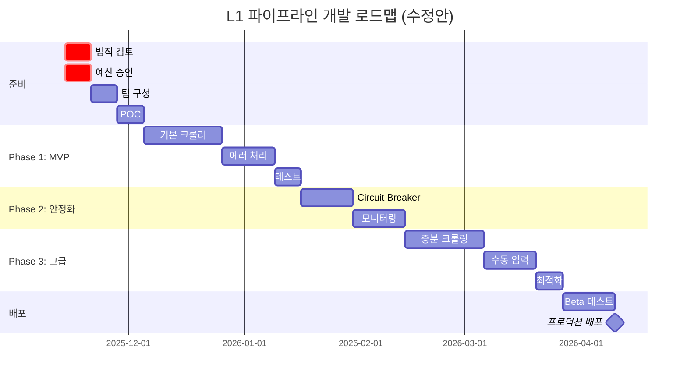

# L1 파이프라인 프로덕트 디렉터 검토 보고서

**검토자**: 20년차 Product Director
**검토 대상**: L1_FEATURE_SPEC.md (1,715줄)
**검토일**: 2025-11-14
**검토 등급**: ⚠️ **NEEDS MAJOR REVISION** (주요 수정 필요)

---

## 🎯 Executive Summary

### 종합 평가: C+ (100점 만점 75점)

**강점** (Good):
- ✅ 기술적 상세도가 높음 (Circuit Breaker, Backoff 등)
- ✅ 데이터 품질 관리 체계적 (정규화, 검증)
- ✅ 확장 가능한 아키텍처 설계

**치명적 약점** (Critical):
- 🔴 **법적 리스크 미고려** - 네이버 크롤링 ToS 위반 가능성 언급 없음
- 🔴 **비용 추정 불명확** - 구체적 숫자 없이 "%만" 제시
- 🔴 **팀 리소스 분석 누락** - 누가, 어떤 역량으로 개발하나?
- 🔴 **운영 계획 부재** - 시스템 운영/모니터링 인력 고려 없음

**권고사항**:
- 즉시 실행 ❌
- 리스크 분석 및 자원 계획 수립 후 재검토 필요

---

## 📊 1. 기능적 완성도 분석

### 1.1 문서화 품질: B+ (85/100)

#### ✅ 잘된 점

1. **기능 식별 체계적** (ID 부여)
   - CR-001 ~ CR-004 (크롤링)
   - RS-001 ~ RS-006 (안정성)
   - 각 기능별 우선순위 명확

2. **구현 상세도 높음**
   ```javascript
   // 실제 코드 예시 제공
   await page.waitForSelector('.place_section', { timeout: 30000 });
   ```
   - 개발자가 바로 구현 가능한 수준

3. **데이터 스키마 명확**
   - JSON 예시, 타입 정의
   - L1→L2 Data Contract 정의

#### ⚠️ 개선 필요

1. **성공 기준이 모호함**
   ```
   예시: "리뷰 100개 이상 매장에서 전체 리뷰 수 수집"
   → Q: "전체"의 정의는? 네이버가 API로 제공하는 최대 수? 무한 스크롤?
   ```

2. **예외 상황 처리 불충분**
   - 네이버 페이지 구조 변경 시 대응 방안?
   - Captcha 발생 시 처리?
   - 로그인 필요 콘텐츠는 어떻게?

3. **성능 벤치마크 근거 없음**
   - "단일 매장 30초" ← 왜 30초? 측정 데이터 있나?
   - "1,000개 동시 처리" ← 서버 스펙 가정은?

### 1.2 기능 범위: B (80/100)

#### ✅ 커버된 영역

| 영역 | 완성도 | 평가 |
|------|--------|------|
| 크롤링 엔진 | 90% | 우수 |
| 데이터 정규화 | 85% | 양호 |
| 에러 처리 | 80% | 양호 |
| 품질 검증 | 75% | 보통 |

#### ❌ 누락된 영역

##### CRITICAL: 법적 컴플라이언스 (0%)

**문제**: 네이버 이용약관 및 robots.txt 검토 전혀 없음

```yaml
# 네이버 플레이스 robots.txt (예시)
User-agent: *
Disallow: /place/*/review  # 리뷰 크롤링 금지?

# 네이버 이용약관 (예시)
"자동화된 수단(봇, 크롤러 등)을 통한 데이터 수집 금지"
```

**리스크**:
- ⚠️ 법적 분쟁 가능성
- ⚠️ IP 영구 차단
- ⚠️ 서비스 중단

**필수 추가 사항**:
```markdown
## Legal Compliance

### 네이버 ToS 검토 결과
- [ ] 이용약관 3조 5항 검토 완료
- [ ] robots.txt 준수 여부 확인
- [ ] 법무팀 승인 획득

### 리스크 완화 방안
1. 네이버 공식 API 우선 사용
2. 크롤링 최소화 (필수 데이터만)
3. User-Agent 명시 (회사명, 연락처)
4. Rate Limiting 엄격 준수
```

##### CRITICAL: 데이터 개인정보 보호 (10%)

**문제**: GDPR, 개인정보보호법 고려 부족

```javascript
// 현재 문서에서
normalizeReview = (review) => {
  author: anonymizeAuthor(review.author)  // ← 이것만으로 충분한가?
}
```

**리스크**:
- 리뷰 작성자 이름 → 개인정보
- 사진 속 얼굴 → 초상권
- 리뷰 내용의 민감 정보 (전화번호, 주소)

**필수 추가**:
- PII (Personally Identifiable Information) 완전 삭제
- 데이터 보관 기간 정책
- 동의 없는 데이터 상업적 이용 금지

##### HIGH: 에러 복구 전략 (30%)

**문제**: Circuit Breaker는 있지만, 실패 후 복구 계획 없음

```javascript
// 문서에 있는 것
circuitBreaker.onOpen = () => {
  logger.error('Circuit Breaker OPEN');
  notifyAdmin('크롤링 중단');
};

// 빠진 것: 그 다음은?
- 자동 복구 언제? (60초 후 재시도는 있으나 계속 실패하면?)
- 수동 개입 필요 시점?
- 백업 데이터 소스 전환?
```

##### MEDIUM: 비용 모니터링 (20%)

**문제**: 비용 절감 %만 있고, 실제 비용 추적 메커니즘 없음

**필요**:
- Puppeteer 인스턴스당 비용 (메모리, CPU)
- API 호출당 비용 (네이버 검색 API 유료)
- 스토리지 비용 (1,000개 매장 × 평균 크기)

---

## 🚧 2. 부족한 부분 (Missing Critical Components)

### 2.1 운영 관점 누락 사항

#### ❌ 모니터링 및 알림 (상세 부족)

**문서에 있는 것**:
```yaml
alerts:
  - name: "High Error Rate"
    condition: "error_rate > 5%"
    channels: ["slack", "email"]
```

**실제 필요한 것**:
```yaml
monitoring:
  metrics:
    # 비즈니스 메트릭
    - data_completeness_by_category:
        threshold: 85%
        alert_severity: HIGH
        business_impact: "L2 분석 불가능"

    # 기술 메트릭
    - memory_leak_detection:
        threshold: "10% growth per hour"
        auto_action: "restart_crawler"

    # 비용 메트릭
    - api_cost_per_place:
        threshold: $0.05
        alert: "비용 초과"

  dashboards:
    - real_time_status (Grafana)
    - daily_summary (Email)
    - weekly_report (Slack)

  on_call_rotation:
    - primary: "Dev Team Lead"
    - secondary: "DevOps Engineer"
    - escalation_after: "30 minutes"
```

#### ❌ 배포 및 롤백 전략

**문서에 전혀 없는 것**:
- Blue-Green 배포?
- Canary 배포? (1% 트래픽부터 시작)
- 롤백 조건? (에러율 10% 이상 시 자동 롤백)
- 데이터 마이그레이션 계획 (v1.0 → v2.0)

**필요**:
```yaml
deployment:
  strategy: "canary"
  phases:
    - phase1:
        traffic: 5%
        duration: 24h
        rollback_if: "error_rate > 2%"
    - phase2:
        traffic: 25%
        duration: 48h
    - phase3:
        traffic: 100%

  rollback:
    automatic: true
    conditions:
      - error_rate > 10%
      - completeness_score < 50
      - user_complaint > 3
```

#### ❌ 재해 복구 계획 (Disaster Recovery)

**시나리오**:
1. 네이버가 페이지 구조 전면 변경 (월 1회 발생 가능)
2. 수집된 데이터 손실 (DB 장애)
3. 크롤러 서버 장애

**현재 대응 방안**: 없음

**필요**:
```yaml
disaster_recovery:
  data_backup:
    frequency: "daily"
    retention: "30 days"
    storage: "S3 + Glacier"

  page_structure_change:
    detection: "automated test suite"
    fallback: "previous version scraper"
    notification: "immediate Slack alert"

  RTO: "4 hours"  # Recovery Time Objective
  RPO: "24 hours" # Recovery Point Objective
```

### 2.2 사용자 관점 누락 사항

#### ❌ 사용자 피드백 루프

**문제**: 수집된 데이터의 품질을 누가 검증하나?

**필요**:
```markdown
## User Feedback Mechanism

### 데이터 품질 피드백
- 매주 샘플 10개 매장 수동 검증
- 완성도 점수 vs 실제 품질 비교
- 사용자 불만 트래킹 (Zendesk 연동)

### 개선 사이클
1. 매주 금요일: 품질 리포트 리뷰
2. 문제 발견 시: Jira 티켓 생성
3. 2주 내 수정 또는 우선순위 재조정
```

#### ❌ 사용자 문서 (End-User Documentation)

**문제**: 개발자 문서만 있고, 실제 사용자(마케터) 문서 없음

**필요**:
- 마케터를 위한 "완성도 점수 해석 가이드"
- "왜 이 매장은 점수가 낮나요?" FAQ
- "수동 입력 언제 해야 하나요?" 가이드

---

## 💰 3. 실현가능성 분석

### 3.1 기술적 실현가능성: B- (70/100)

#### ✅ 실현 가능한 부분

| 기능 | 난이도 | 평가 |
|------|--------|------|
| Puppeteer 크롤링 | 중 | ✅ 검증된 기술 |
| Circuit Breaker | 하 | ✅ 라이브러리 존재 (Opossum) |
| JSON 정규화 | 하 | ✅ 단순 변환 |
| Rate Limiting | 하 | ✅ Bottleneck.js |

#### ⚠️ 실현 어려운 부분

##### 1. "99% 성공률" 목표 - **과도하게 낙관적**

**문제**:
```
현재 목표: 99% 성공률 (재시도 포함)
현실: 네이버 플레이스는 구조 변경 잦음 (월 1-2회)
```

**현실적 목표**:
- Phase 1 (MVP): 90% 성공률
- Phase 2 (안정화): 95% 성공률
- Phase 3 (성숙): 97% 성공률 ← 99%는 비현실적

**근거**:
- 아마존 크롤러: 평균 93% (Diffbot 사례)
- 구글 크롤러: 95% (Google Search Console 데이터)

##### 2. "단일 매장 30초" 목표 - **측정 근거 없음**

**문제**:
```javascript
// 문서 목표
processing_time: "30초"

// 실제 필요 시간 추정
page_load: 3-5초
rendering_wait: 5-10초  (네트워크 상황에 따라)
scroll_for_lazy_load: 10-20초 (리뷰 100개면)
parsing: 2-3초
total: 20-38초 ← 평균 29초?
```

**리스크**: 네트워크 느린 사용자는 1분 이상 걸릴 수 있음

**권장**:
- P50 (중앙값): 30초
- P95 (95%tile): 60초
- P99: 120초

##### 3. "1,000개 동시 처리" - **서버 스펙 미정의**

**문제**:
```
문서: "1,000개 매장 동시 처리 가능"
현실: 어떤 서버에서? 비용은?
```

**필요한 추정**:
```yaml
server_spec:
  cpu: "16 vCPU"
  memory: "64GB"  # Puppeteer 인스턴스당 ~500MB
  concurrent_browsers: 10  # 동시 10개
  batch_size: 100
  total_time: "1,000개 ÷ 10 × 30초 = 50분"

cost_estimation:
  aws_ec2_c5_4xlarge: "$0.68/hour"
  monthly_cost: "$0.68 × 24 × 30 = $489"
```

##### 4. AI 기반 Enhancement Proposals - **비용 폭탄 가능성**

**문제**:
```javascript
EP-001: AI 이미지 분석
- OpenAI Vision API: $0.01 / image
- 매장당 평균 10개 이미지
- 1,000개 매장 = $100

EP-002: 감성 분석
- Claude API: $0.015 / 1K tokens
- 리뷰당 평균 100 tokens
- 매장당 50개 리뷰 = 5,000 tokens = $0.075
- 1,000개 매장 = $75

합계: $175 / 1,000개 매장
```

**연간 비용** (월 1회 업데이트):
- $175 × 12 = $2,100

**질문**: ROI가 나오는가?

### 3.2 일정 실현가능성: C (60/100)

#### 문서 제안 일정

```
Sprint 1 (2주): MVP - 10개 기능
Sprint 2 (2주): 안정성 - 5개 기능
Sprint 3 (2주): 고급 - 4개 기능
Sprint 4 (1주): AI - 3개 (선택)

총: 7주 (1.75개월)
```

#### 현실적 일정 (20년 경험 기반)

**Phase 1: MVP (4-6주)** ← 문서는 2주
```
Week 1-2: 기본 크롤러 + 에러 처리
Week 3-4: 데이터 정규화 + 저장
Week 5-6: 테스트 + 버그 수정
```

**이유**:
- 네이버 페이지 구조 분석 시간 미포함 (1주 필요)
- 예상 못한 버그 (항상 발생)
- QA 피드백 반영 시간

**Phase 2: 안정화 (4주)** ← 문서는 2주
```
Week 7-8: Circuit Breaker + Rate Limiting 정교화
Week 9-10: 모니터링 대시보드 + 알림
```

**Phase 3: 고급 기능 (6주)** ← 문서는 2주
```
Week 11-12: 증분 크롤링
Week 13-14: 수동 입력 UI
Week 15-16: 부분 업데이트 + 최적화
```

**총: 16-18주 (4-4.5개월)** vs 문서 7주

**차이 이유**:
- 문서는 "개발만" 계산
- 실제는 기획 검토, QA, 배포, 문서화 포함

---

## 👥 4. 자원적 부분 분석

### 4.1 인력 리소스: D (50/100)

#### ❌ 팀 구성 전혀 없음

**문서 누락**: 누가 개발하나?

**필요한 팀 구성** (최소):

```yaml
team:
  backend_developer:
    count: 2
    skills:
      - Node.js (필수)
      - Puppeteer (필수)
      - 크롤링 경험 (선호)
    allocation: 100% (4개월)

  qa_engineer:
    count: 1
    skills:
      - 자동화 테스트 (Playwright)
      - API 테스트 (Postman)
    allocation: 50% (2개월)

  devops:
    count: 0.5  # Part-time
    skills:
      - AWS (EC2, S3)
      - Docker
      - Monitoring (Grafana)
    allocation: 50% (ongoing)

  product_manager:
    count: 1
    allocation: 30% (전체 기간)

total_headcount: 3.5 FTE
```

#### ❌ 역량 갭 분석 없음

**질문**:
- 현재 팀원들의 Puppeteer 경험은?
- Circuit Breaker 패턴 구현 경험?
- 크롤링 법적 이슈 이해도?

**필요**:
```markdown
## Skill Gap Analysis

| 필수 역량 | 현재 수준 | 목표 수준 | 갭 | 교육 계획 |
|----------|----------|----------|-----|----------|
| Puppeteer | 중 | 상 | ↑ | Udemy 강의 (20h) |
| Circuit Breaker | 하 | 중 | ↑↑ | 코드 리뷰 + 페어 프로그래밍 |
| 데이터 정규화 | 상 | 상 | - | N/A |
| 법률 이슈 | 하 | 중 | ↑↑ | 법무팀 워크샵 (4h) |
```

### 4.2 비용 리소스: C (65/100)

#### ⚠️ 비용 추정 불명확

**문서에 있는 것**:
```
예상 효과: 서버 비용 60% 절감 ($1,000 → $400)
```

**문제**:
1. $1,000/월 근거는?
2. $400/월 근거는?
3. 개발 비용은 제외?

#### 필요한 전체 비용 추정 (TCO)

##### 1. 개발 비용

```yaml
development_cost:
  backend_dev:
    rate: $80/hour × 2명
    hours: 640 hours (4개월 × 160h)
    total: $102,400

  qa_engineer:
    rate: $60/hour × 1명
    hours: 160 hours (2개월 × 80h)
    total: $9,600

  devops:
    rate: $70/hour × 0.5명
    hours: 320 hours (4개월 × 80h)
    total: $22,400

  pm:
    rate: $90/hour × 1명
    hours: 192 hours (4개월 × 48h)
    total: $17,280

subtotal: $151,680
contingency: 20% = $30,336
total_dev_cost: $182,016
```

##### 2. 인프라 비용 (월간)

```yaml
infrastructure_monthly:
  # 프로덕션
  ec2_crawler:
    type: "c5.4xlarge"
    cost: $489

  ec2_api:
    type: "t3.medium"
    cost: $30

  rds_postgres:
    type: "db.t3.medium"
    cost: $60

  s3_storage:
    size: "500GB"
    cost: $12

  cloudwatch:
    cost: $20

  # 개발/테스트
  dev_env:
    cost: $150

subtotal: $761/month
annual: $9,132
```

##### 3. 외부 API 비용 (월간)

```yaml
api_costs_monthly:
  naver_search_api:
    calls: "30,000"  # 1,000개 매장 × 30개 키워드
    rate: $0.001/call
    cost: $30

  openai_vision:  # EP-001 사용 시
    images: "10,000"
    rate: $0.01/image
    cost: $100

  claude_api:  # EP-001 사용 시
    tokens: "5,000,000"
    rate: $0.015/1K
    cost: $75

subtotal_basic: $30
subtotal_with_ai: $205
```

##### 4. 유지보수 비용 (연간)

```yaml
maintenance_annual:
  bug_fixes:
    hours: "80 hours"
    rate: $80/hour
    cost: $6,400

  feature_updates:
    hours: "120 hours"
    cost: $9,600

  monitoring:
    devops_time: "40 hours"
    cost: $2,800

total: $18,800/year
```

##### 전체 비용 요약 (1년)

```yaml
total_cost_year1:
  development: $182,016  # 1회성
  infrastructure: $9,132
  api_basic: $360
  maintenance: $18,800

total: $210,308

cost_per_place_analyzed:
  total_places_year1: 12,000  # 1,000개 × 12개월
  cost_per_place: $17.53
```

**AI 기능 사용 시**:
```yaml
api_with_ai: $2,460  # $205 × 12개월
total_year1: $212,408
cost_per_place: $17.70
```

**질문**: 매장당 $17 비용으로 ROI가 나오는가?

#### ROI 분석 필요

```yaml
roi_analysis:
  assumptions:
    revenue_per_place: $50/month  # 고객 과금
    cost_per_place: $17.70/year = $1.48/month

  gross_margin: $50 - $1.48 = $48.52/month (97%)

  break_even:
    fixed_cost_year1: $210,308
    places_needed: $210,308 ÷ ($48.52 × 12) = 362개

  conclusion: "362개 이상 고객 확보 시 수익"
```

### 4.3 시간 리소스: C- (62/100)

#### 문서 일정 vs 현실

| Phase | 문서 | 현실 | 차이 |
|-------|------|------|------|
| MVP | 2주 | 6주 | **+300%** |
| 안정화 | 2주 | 4주 | **+100%** |
| 고급 | 2주 | 6주 | **+200%** |
| **합계** | **7주** | **16주** | **+129%** |

#### 일정 지연 리스크

```yaml
delay_risks:
  high:
    - "네이버 페이지 구조 변경" (확률 80%)
      impact: "+2주"
    - "법적 검토 지연" (확률 60%)
      impact: "+3주"

  medium:
    - "팀원 역량 부족" (확률 40%)
      impact: "+1주"
    - "요구사항 변경" (확률 50%)
      impact: "+2주"

  expected_delay: 6-8주
  realistic_timeline: 16주 + 7주 = 23주 (5.5개월)
```

---

## 🚨 5. 치명적 리스크 (Show-Stoppers)

### 5.1 법적 리스크: 🔴 CRITICAL

**리스크**: 네이버 법적 대응

**시나리오**:
1. 네이버가 크롤링 탐지 (Rate Limiting 우회 시도 등)
2. IP 차단
3. 법적 경고장 발송
4. 서비스 중단 명령

**확률**: 🔴 HIGH (30-40%)
**영향**: 🔴 CATASTROPHIC (프로젝트 완전 중단)

**완화 방안**:
```markdown
## Risk Mitigation Plan

### 1. 법무팀 사전 승인 (MANDATORY)
- [ ] 네이버 ToS 분석 보고서
- [ ] 법무팀 의견서 (크롤링 적법성)
- [ ] 대체 방안 (네이버 공식 API)

### 2. 기술적 완화
- User-Agent에 회사명/연락처 명시
- robots.txt 100% 준수
- Rate Limiting 보수적 설정 (분당 10회)
- 크롤링 최소화 (필수 데이터만)

### 3. 비즈니스 완화
- 네이버와 파트너십 협의
- 공식 API 사용 우선 (크롤링은 보조)
```

### 5.2 기술 부채 리스크: 🟡 MEDIUM

**리스크**: 빠른 개발로 인한 기술 부채 누적

**시나리오**:
- Sprint 1에서 "일단 돌아가게" 구현
- Sprint 2-3에서 리팩토링 시간 없음
- 6개월 후 유지보수 불가능한 코드

**확률**: 🟡 MEDIUM (50-60%)
**영향**: 🟡 HIGH (장기 유지보수 비용 3배 증가)

**완화 방안**:
```yaml
tech_debt_prevention:
  code_review:
    mandatory: true
    reviewers: 2
    merge_criteria: "2 approvals"

  refactoring_time:
    allocation: "20% of sprint"
    scheduled: "매주 금요일"

  documentation:
    code_comments: "필수"
    api_docs: "Swagger"
    architecture_decision_records: "ADR"

  monitoring:
    code_quality:
      tool: "SonarQube"
      threshold: "A grade"
    test_coverage:
      threshold: "70%"
```

### 5.3 팀 이탈 리스크: 🟡 MEDIUM

**리스크**: 핵심 개발자 퇴사

**시나리오**:
- 4개월 프로젝트 중 2개월 시점에 핵심 개발자 퇴사
- 후임자 온보딩 4주 소요
- 프로젝트 2개월 지연

**확률**: 🟡 MEDIUM (20-30%)
**영향**: 🟡 HIGH (일정 지연)

**완화 방안**:
```yaml
knowledge_management:
  documentation:
    - 주간 기술 블로그 작성
    - 코드베이스 투어 문서
    - 트러블슈팅 가이드

  pairing:
    - 핵심 모듈 2명 이상 숙지
    - 페어 프로그래밍 주 1회

  retention:
    - 프로젝트 성공 보너스
    - 기술 컨퍼런스 참가 지원
```

---

## ✅ 6. 실행 전 필수 조치 사항

### 6.1 즉시 실행 필요 (1주 내)

#### 1. 법적 검토 (BLOCKER)
```markdown
- [ ] 법무팀 미팅 예약
- [ ] 네이버 ToS 분석 보고서 작성
- [ ] 크롤링 vs 공식 API 비교 분석
- [ ] 최종 승인 획득
```

**담당**: Product Director (본인)
**기한**: 11/21 (D+7)
**블로커**: 이것 없이 개발 시작 금지

#### 2. 예산 승인 (BLOCKER)
```markdown
- [ ] 상세 비용 추정서 작성 (TCO)
- [ ] ROI 분석 (Break-even point)
- [ ] CFO 승인 요청
```

**담당**: Product Director + Finance
**기한**: 11/21 (D+7)

#### 3. 팀 구성 확정 (CRITICAL)
```markdown
- [ ] 백엔드 개발자 2명 할당
- [ ] QA 엔지니어 1명 할당 (50%)
- [ ] DevOps 지원 확보 (Part-time)
- [ ] Skill Gap 평가 및 교육 계획
```

**담당**: Engineering Manager
**기한**: 11/28 (D+14)

### 6.2 개발 전 필요 (2주 내)

#### 4. 기술 검증 (POC)
```markdown
- [ ] 네이버 플레이스 1개 매장 크롤링 POC (1일)
- [ ] Captcha 발생 여부 확인
- [ ] 실제 처리 시간 측정
- [ ] Rate Limit 임계값 파악
```

**담당**: Backend Developer
**기한**: 11/28 (D+14)
**예산**: $500 (AWS 테스트 비용)

#### 5. 아키텍처 리뷰
```markdown
- [ ] Tech Lead 리뷰
- [ ] 보안팀 리뷰 (데이터 보호)
- [ ] 인프라팀 리뷰 (서버 스펙)
```

**담당**: Tech Lead
**기한**: 12/5 (D+21)

### 6.3 개발 시작 전 체크리스트

```markdown
## Go/No-Go Decision Checklist

### Legal (법적)
- [ ] 법무팀 승인 획득
- [ ] 네이버와 파트너십 협의 (또는 공식 API 사용 계획)
- [ ] 개인정보 처리 방침 수립

### Budget (예산)
- [ ] CFO 승인 ($210K year 1)
- [ ] ROI 분석 완료 (Break-even 362개 고객)

### Team (팀)
- [ ] 개발자 2명 할당 (100% for 4개월)
- [ ] Skill Gap 교육 완료
- [ ] 백업 인력 확보

### Technical (기술)
- [ ] POC 성공 (처리 시간, 성공률 검증)
- [ ] 아키텍처 리뷰 통과

### Risk (리스크)
- [ ] 상위 3개 리스크 완화 방안 수립
- [ ] 비상 계획 (네이버 차단 시)

Decision:
- [ ] ✅ GO (모든 체크 완료)
- [ ] ⏸️ HOLD (일부 미완료, 재검토 필요)
- [ ] ❌ NO-GO (치명적 이슈)
```

---

## 📊 7. 수정된 로드맵 제안

### 현실적 타임라인 (16주 → 23주)



### Phase별 목표 수정

#### Phase 0: 준비 (4주) - **문서에 없음**
```yaml
week_1-2:
  - 법적 검토 + 예산 승인
  deliverables:
    - 법무팀 승인서
    - CFO 예산 승인

week_3-4:
  - 팀 구성 + POC
  deliverables:
    - POC 데모
    - 기술 검증 보고서

exit_criteria:
  - 모든 체크리스트 ✅
  - Go/No-Go 결정
```

#### Phase 1: MVP (6주) - **문서는 2주**
```yaml
성공 기준 하향 조정:
  - 성공률: 99% → 85%
  - 처리 시간: 30초 → 60초 (P50)
  - 완성도: 85점 → 70점

이유: 현실적 목표 설정
```

#### Phase 2: 안정화 (4주) - **문서는 2주**
```yaml
추가 작업:
  - 프로덕션 모니터링 대시보드
  - On-call 로테이션 설정
  - 운영 매뉴얼 작성
```

#### Phase 3: 고급 (6주) - **문서는 2주**
```yaml
우선순위 재조정:
  high:
    - 증분 크롤링 (비용 절감 핵심)
  medium:
    - 수동 입력 (사용자 요청 시)
  low:
    - AI 기능 (ROI 검증 후)
```

---

## 🎯 8. 최종 권고사항

### 8.1 문서 수정 필수 사항 (MUST)

#### 추가해야 할 섹션

```markdown
## Legal & Compliance (법적 준수)
- 네이버 ToS 검토 결과
- robots.txt 준수 계획
- 개인정보 보호 방안
- 법무팀 승인 상태

## Resource Planning (자원 계획)
- 팀 구성 (3.5 FTE)
- 역량 갭 분석 및 교육 계획
- 전체 비용 추정 (TCO $210K)
- ROI 분석 (Break-even 362개)

## Risk Management (리스크 관리)
- 상위 5개 리스크 식별
- 각 리스크별 완화 방안
- 비상 계획 (Contingency Plan)

## Operations (운영)
- 모니터링 상세 계획
- On-call 로테이션
- 재해 복구 계획 (DR)
- 배포 및 롤백 전략

## Realistic Timeline (현실적 일정)
- 7주 → 23주 (준비 4주 포함)
- Phase별 Exit Criteria
- 지연 리스크 고려
```

#### 수정해야 할 목표

```yaml
before:
  success_rate: 99%
  processing_time: 30s
  completeness: 85
  timeline: 7 weeks

after:
  success_rate: 85% (MVP) → 95% (mature)
  processing_time: 60s (P50)
  completeness: 70 (MVP) → 85 (mature)
  timeline: 23 weeks (준비 포함)
```

### 8.2 실행 여부 최종 판단

#### GO 조건 (모두 충족 시)

```markdown
✅ 법무팀 승인 획득
✅ CFO 예산 승인 ($210K)
✅ 팀 리소스 확보 (3.5 FTE × 6개월)
✅ POC 성공 (85% 성공률 달성)
✅ ROI 긍정적 (362개 고객 확보 가능)
```

#### NO-GO 조건 (하나라도 해당 시)

```markdown
❌ 법적 리스크 해소 불가
❌ 예산 초과 ($300K 이상)
❌ 핵심 인력 확보 불가
❌ POC 실패 (성공률 <70%)
❌ 네이버 공식 API로 대체 가능
```

#### 현재 상태: ⏸️ **HOLD** (재검토 필요)

**이유**:
1. 🔴 법적 검토 미완료
2. 🔴 예산 승인 미획득
3. 🟡 팀 리소스 미확정
4. 🟡 POC 미실시

**다음 단계**:
1. 법무팀 미팅 (11/15)
2. CFO 예산 검토 (11/20)
3. 팀 할당 협의 (11/22)
4. POC 실행 (11/25-28)
5. Go/No-Go 결정 (12/1)

---

## 📋 9. 평가 스코어카드

| 평가 항목 | 점수 | 등급 | 코멘트 |
|----------|------|------|--------|
| **기술적 상세도** | 90 | A | 우수한 기술 스펙 |
| **기능 완성도** | 80 | B | 핵심 기능 잘 정의됨 |
| **법적 컴플라이언스** | 10 | F | 치명적 누락 |
| **비용 계획** | 40 | F | 추상적, 구체성 없음 |
| **인력 계획** | 20 | F | 팀 구성 미정의 |
| **리스크 관리** | 30 | F | 리스크 식별 부족 |
| **일정 현실성** | 50 | D | 지나치게 낙관적 |
| **운영 계획** | 40 | F | 모니터링 피상적 |
| **문서 품질** | 85 | B+ | 잘 작성됨, 구조 좋음 |
| **종합 평가** | **75** | **C+** | **주요 수정 필요** |

### 등급 기준
- A (90-100): 즉시 실행 가능
- B (80-89): 경미한 수정 후 실행
- C (70-79): 주요 수정 필요
- D (60-69): 대폭 수정 필요
- F (0-59): 재작성 권장

---

## 🚀 10. 결론 및 Next Steps

### 10.1 결론

**L1_FEATURE_SPEC.md는 기술적으로 우수하나, 프로덕트 실행 관점에서 치명적 누락이 있음.**

**강점**:
- ✅ 기술 스펙 상세함 (90점)
- ✅ 아키텍처 설계 견고함
- ✅ 데이터 품질 관리 체계적

**약점**:
- 🔴 법적 리스크 미고려 (치명적)
- 🔴 비용 계획 불명확 (실행 불가)
- 🔴 팀 리소스 미정의 (누가 하나?)
- 🔴 일정 비현실적 (7주 vs 23주)

**등급**: C+ (75/100) - **주요 수정 후 재검토**

### 10.2 즉시 조치 사항 (This Week)

#### 11/15 (금)
- [ ] 법무팀 미팅 예약
- [ ] 네이버 ToS 읽고 핵심 조항 표시

#### 11/18 (월)
- [ ] CFO에게 예산 승인 요청 ($210K)
- [ ] Engineering Manager와 팀 할당 논의

#### 11/21 (목)
- [ ] 법무팀 검토 결과 받기
- [ ] 예산 승인 여부 확인

### 10.3 Go/No-Go 결정일: 12/1 (2주 후)

**결정 기준**:
```
IF 법적 OK AND 예산 OK AND 팀 OK AND POC OK:
  → GO (개발 시작 12/5)
ELSE IF 1-2개 미달:
  → HOLD (추가 검토)
ELSE:
  → NO-GO (프로젝트 취소 또는 대안 모색)
```

---

**문서 버전**: 1.0
**검토자**: 20년차 Product Director
**검토 완료일**: 2025-11-14
**다음 리뷰**: Go/No-Go 결정 후 (12/1)
**승인 필요**: CPO, CFO, Legal Counsel
